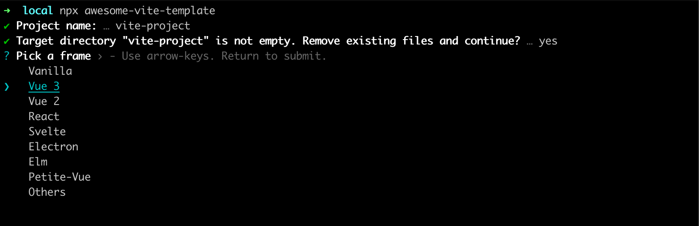
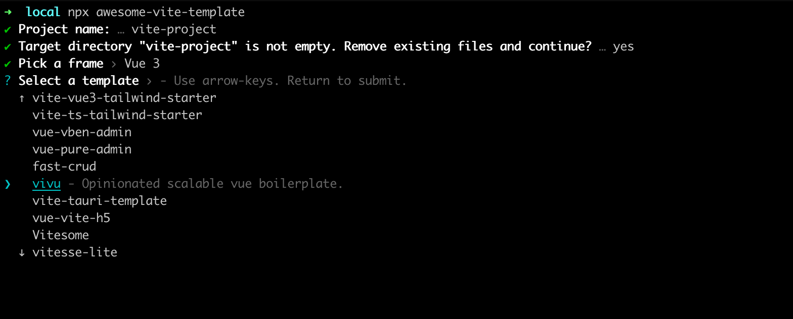

This is a tool to clone vite template which list in [awesome-vite][1]

## Usage

    npm install -g awesome-vite-template
    avtt

or 

    npx awesome-vite-template

## Screenshot

[1]: https://github.com/vitejs/awesome-vite#templates